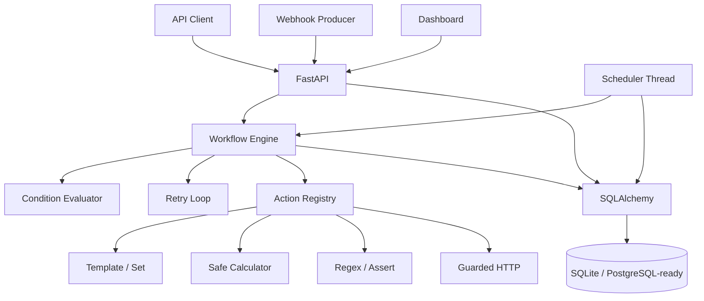

# Architecture

Automation Ops Hub separates workflow definition, trigger transport, execution, persistence, and scheduling so each concern can evolve independently.

## Domain model

- **Workflow** stores a version-like JSON definition plus a generated webhook token.
- **WorkflowRun** stores one execution, its trigger, idempotency key, input/output, status, error, and duration.
- **StepRun** stores granular execution evidence for every workflow step.
- **Schedule** stores an interval and the next due execution time.
- **AuditEvent** provides an operations/event record independent of workflow output.

## Execution lifecycle

1. Resolve a workflow from the API, webhook token, or schedule.
2. Check idempotency when a key is supplied.
3. Create a `RUNNING` workflow run.
4. Copy input into a mutable execution context.
5. Evaluate each step's optional `when` condition.
6. Execute the action with bounded retries.
7. Persist a `StepRun` with attempts, timing, output, or error.
8. Stop on an unrecovered failure.
9. Persist final output and mark the run `SUCCEEDED` or `FAILED`.
10. Record an audit event.

## Scheduler design

The demo includes a lightweight daemon thread. It polls for due schedule rows and invokes the same workflow engine used by API and webhook triggers. Tests disable the background thread and can call the scheduler tick function deterministically.

A production-scale system would replace this thread with a durable queue/scheduler such as Celery, Dramatiq, Temporal, or a cloud scheduler while preserving the execution engine boundary.

## Security boundaries

The arithmetic action parses expressions through Python's AST and accepts only numeric constants, variables, and whitelisted arithmetic operators. It does not use `eval`.

Outbound HTTP workflow steps are disabled by default. When enabled, an optional hostname allowlist limits destinations and mitigates SSRF risk.
